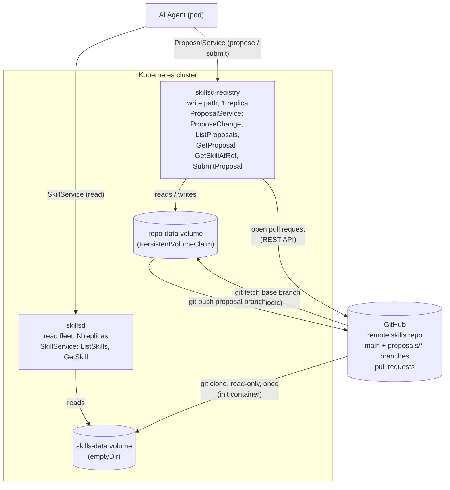

# skillset

`skillset` is a gRPC registry service for [agentskills.io](https://agentskills.io)-compatible agent skills. It discovers, indexes, and serves skill metadata and content — it does **not** execute skills. Skill definitions live in a git repository, and the project ships two components around that repository:

- **`skillsd`** — a read-only fleet. An init container clones the skills repo into a pod-local volume at startup; `skillsd` reads that volume once and serves it over gRPC (`SkillService`) for the lifetime of the process.
- **`skillsd-registry`** (optional, enabled by default) — a single-replica write path that lets AI agents propose changes to a skill as a real git commit on a dedicated branch, inspect that proposal (including its diff against the base branch), view a skill as of any ref, and submit the proposal as a GitHub pull request for human review (`ProposalService`). See [Proposals and PR submission (skillsd-registry)](#proposals-and-pr-submission-skillsd-registry) below.

---

## Architecture



`skillsd` and `skillsd-registry` share one Helm chart ([charts/skillsd](charts/skillsd)) but run as independent Deployments — the read fleet scales horizontally and never mutates anything; the registry is a single writer serializing git operations on its own persistent volume. See [proto/skills/v1](proto/skills/v1) for the two services' full RPC definitions, and [internal/](internal/) for their implementations (`registry`/`server`/`storage` back `skillsd`; `gitrepo`/`proposals`/`githubpr`/`proposalserver`/`registryconfig` back `skillsd-registry`; `skillparse` is shared by both).

---

## Skill format

Each skill is a directory containing a `SKILL.md` file with YAML frontmatter (`name`, `description` required; `license`, `compatibility`, `metadata`, `allowed-tools` optional), plus any supporting `scripts/`, `references/`, or `assets/` files. See the [agentskills.io specification](https://agentskills.io/specification) for the full format.

`registry.Load` walks the mounted skills directory once at startup, requires each skill's directory name to match its frontmatter `name`, and builds an in-memory index served over gRPC. There is no runtime re-indexing in `skillsd` — picking up new skills means restarting the pod so the init container re-clones the repo. (`skillsd-registry`, described below, is the exception: it's meant to track live upstream state, and periodically re-fetches its base branch in the background.)

`internal/skillparse` — the frontmatter parsing and validation logic used above — is shared with `skillsd-registry`, so a skill read at a proposal branch or an arbitrary commit is validated exactly the same way as the static production index.

---

## Proposals and PR submission (skillsd-registry)

`skillsd-registry` is an optional, single-replica component (`registry.enabled: true` by default in the Helm chart) that gives AI agents a write path onto skills, without exposing raw git or GitHub credentials to them directly. It owns a real git working copy on a persistent volume and exposes `ProposalService`:

| RPC | Purpose |
|---|---|
| `ProposeChange` | Commits full new file content for one or more files in a skill onto the caller's proposal branch, creating the branch (forked from the current base branch HEAD) if it's the first call, or appending a commit if the agent is iterating. |
| `ListProposals` | Lists proposals, optionally filtered by skill and/or agent. |
| `GetProposal` | Fetches a single proposal by its branch name, including its unified diff against base and its commit history. |
| `GetSkillAtRef` | Fetches a skill's metadata as of an arbitrary ref (a branch name or commit SHA), reusing `internal/skillparse`. |
| `SubmitProposal` | Pushes the proposal's branch upstream and opens a GitHub pull request against the base branch, for a human to review. |

Branches are namespaced `proposals/<agent_id>/<skill_name>/<proposal_id>`, which doubles as the lookup/filter key for `ListProposals` — there's no separate proposal-status field or database: a proposal's state *is* whatever's on its branch, and once `SubmitProposal` opens a pull request, that PR (on GitHub) is the review and merge mechanism. Submitting full file content rather than a patch means the server computes the diff itself, and callers never need to worry about applying a patch against a base they may not have in sync; merging a stale-looking proposal branch is left entirely to GitHub's own PR UI rather than reimplemented locally.

Deploying it requires an HTTPS clone URL with push access and a GitHub token (used for both the `git push` and the PR-creation REST call) — see the `registry.*` values in [charts/skillsd/values.yaml](charts/skillsd/values.yaml).

---

## GitHub authentication

Both components authenticate to GitHub the same way — an HTTPS clone URL plus a GitHub token — just scoped to what each one actually needs:

| | `skillsd` | `skillsd-registry` |
|---|---|---|
| Needs | `git clone` only | `git push` **and** the GitHub REST API (PR creation) |
| Credential | GitHub token (optional) | GitHub token (required if `submitProposalEnabled`) |
| Wired in via | `skillsRepo.tokenSecret` (`token`, used as an HTTPS Basic-auth password) | `registry.github.tokenSecret` (`GITHUB_TOKEN`) |
| Required scope | `Contents: read` (fine-grained), or `repo` (classic, read access is still all that's used) | `Contents: read/write` + `Pull requests: read/write` (fine-grained), or `repo` (classic) |

`skillsd`'s init container only ever reads the skills repo, so a token scoped to read-only access is sufficient — and it's left empty by default, since a public repo needs no auth at all.

`skillsd-registry` needs to authenticate two different operations — the `git push` of a proposal branch and the GitHub API call that opens the pull request — and a single GitHub token can do both over HTTPS. Scope each token as narrowly as your GitHub plan allows: a fine-grained PAT limited to the one skills repo, with just `Contents: read` for `skillsd` or `Contents` + `Pull requests` write access for `skillsd-registry`, or a classic PAT with `repo` scope if fine-grained tokens aren't available. Leaving `GITHUB_TOKEN`/`registry.github.tokenSecret` unset runs `skillsd-registry` in propose-only mode (`ProposeChange`, `GetProposal`, etc. still work; `SubmitProposal` is disabled).

---

## Configuration

Both binaries load configuration from environment variables on startup.

`skillsd` ([internal/config](internal/config)):

| Environment Variable | Default   | Description                                                                 |
|-----------------------|-----------|-------------------------------------------------------------------------------|
| `GRPC_ADDR`            | `:8080`   | Address the gRPC server listens on                                            |
| `SKILLS_DIR`           | `/skills` | Local directory the skills volume is mounted at (populated by the init container) |
| `SKILLS_SUBPATH`       | `""`      | Optional subdirectory within `SKILLS_DIR` where skill directories actually live |
| `GRPC_MAX_RECV_MSG_SIZE_BYTES` | `8388608` (8 MiB) | Cap on a single incoming gRPC message (`grpc.MaxRecvMsgSize`) |
| `GRPC_MAX_SEND_MSG_SIZE_BYTES` | `8388608` (8 MiB) | Cap on a single outgoing gRPC message (`grpc.MaxSendMsgSize`) - relevant for `GetSkillAtRef` responses with context files |

`skillsd-registry` ([internal/registryconfig](internal/registryconfig)):

| Environment Variable | Default | Description |
|---|---|---|
| `GRPC_ADDR` | `:8081` | Address the `ProposalService` gRPC server listens on |
| `REPO_DIR` | `/var/lib/skillsd-registry` | Local directory the git working copy is kept in (expected to be a persistent volume) |
| `SKILLS_REPO_URL` | — (required) | HTTPS clone URL of the skills repository |
| `SKILLS_REPO_BASE_BRANCH` | `main` | Branch proposals fork from and pull requests target |
| `SKILLS_SUBPATH` | `""` | Same meaning as `skillsd`'s `SKILLS_SUBPATH` |
| `GITHUB_TOKEN` | — (required) | Used for both the HTTPS git push and the GitHub REST API |
| `GITHUB_OWNER` / `GITHUB_REPO` | — (required) | Repository pull requests are opened against |
| `GITHUB_API_BASE_URL` | `https://api.github.com` | Override for GitHub Enterprise |
| `FETCH_INTERVAL` | `5m` | How often the base branch is re-fetched from origin in the background |
| `GRPC_MAX_RECV_MSG_SIZE_BYTES` | `8388608` (8 MiB) | Cap on a single incoming gRPC message (`grpc.MaxRecvMsgSize`) - the whole `ProposeChangeRequest`, including every `FileChange` in the call |
| `GRPC_MAX_SEND_MSG_SIZE_BYTES` | `8388608` (8 MiB) | Cap on a single outgoing gRPC message (`grpc.MaxSendMsgSize`) - relevant for `GetProposal`'s diff and `GetSkillAtRef`'s context files |
| `MAX_FILE_CONTENT_BYTES` | `1048576` (1 MiB) | Cap on a single `FileChange`'s content in `ProposeChange`, checked before the gRPC transport would otherwise reject an oversized message |
| `LOG_LEVEL` | `info` | Minimum slog level emitted |

---

## Local development

Local dev runs on a `kind` cluster provisioned by `ctlptl`, with `Tilt` handling build/deploy/live-reload. Requires `go`, `docker`, `kind`, `ctlptl`, `kubectl`, `helm`, `tilt`, and `buf` on `PATH`.

```bash
make dev    # runs `cluster-up` followed by `tilt up`
```

For a private skills repo, drop a GitHub token scoped read-only to it at `local/git-skillsd-token` (gitignored) before running `make dev` — the Tiltfile creates a Secret from it and wires it into the chart automatically.

To also exercise `skillsd-registry` locally, fill in `registry.skillsRepo.url` and `registry.github.owner`/`repo` in [local/values.yaml](local/values.yaml), then drop a GitHub token (push + pull-request write access on that repo) at `local/git-skillsd-registry-token` (gitignored) — the Tiltfile creates a Secret from it and sets `registry.enabled=true` automatically. See [local/README.md](local/README.md) for a full `grpcurl` walkthrough of `ProposalService`, including what scopes to put on each token.

Run `make help` for the full list of targets (build, test, vet, proto codegen, docker build, helm lint/template, cluster teardown, log tailing, etc).

Tear down the cluster with:

```bash
make cluster-down
```
