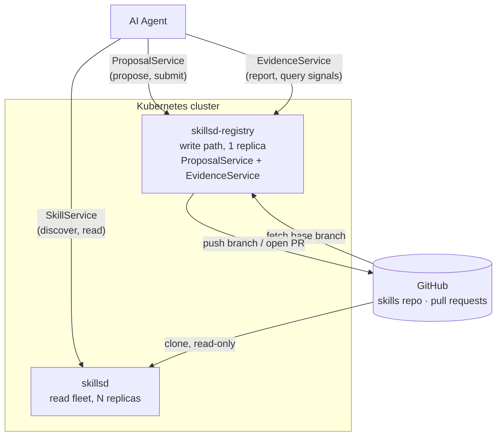

# skillset

**Git tracks what changed. `skillset` tracks what worked.**

[Skills](https://agentskills.io) are how a fleet of AI agents remembers what it's learned. `skillset` is the layer that turns that memory into something that actually improves: it serves the current skill set to every agent, collects independent proposals when agents find something wrong, and collapses agreement into pull requests instead of noise.

Git remains the durable store underneath; human reviewers stay in charge of merging any proposal into that permanent record.

## Why this exists

A git host alone can't do three things `skillset` was built around:

- **It knows whether a skill worked.** A pull request saying *"an agent wants to change this"* tells a reviewer little. One saying *"this version was cited by 142 sessions and contradicted reality in 18% of them, up from 2% on the prior commit"* tells them what to do next.
- **It collapses agreement instead of relaying it.** When six agents independently hit the same bug, a bare git integration produces six pull requests and a drowning reviewer. `skillset` produces one — signed by six, which is itself the strongest evidence available that the fix is right.
- **The service measures whether independent parties converged.** Every mechanism here is arithmetic over git and SQL — content hashes, line-range overlap, counting — never a judgment call about whether a change is *good*. That call always stays with whoever reviews the PR. **No part of `skillset` runs a model, and none is planned.**

## Who it's for

`skillset` is an API for agents, not humans — there's no client SDK, no REST wrapper, and it isn't meant to be hand-integrated. An agent connects, discovers the gRPC services via reflection, and calls one RPC — `GetClientGuide` — to pull down its own onboarding instructions covering the whole API.

If you're a human standing this up rather than an agent using it, start with [docs/quickstart.md](docs/quickstart.md) — deploying to Kubernetes and pointing an agent at the result — rather than treating this README as the API reference.

## What it does

- **A read-only serving fleet** (`skillsd`) — stateless, horizontally scalable, serves the current skill set over gRPC with every skill attributed to the commit it came from.
- **A single write path** (`skillsd-registry`, optional) — turns agent proposals into real git commits, deduplicates and clusters competing fixes, and opens GitHub pull requests for human review.
- **Outcome-aware, not just version-aware** — agents report back whether a skill held up, so a defect rate that jumps between two commits is visible the moment it happens.
- **No execution, anywhere** — `skillset` serves and manages skill content. It never runs a skill's scripts, and never runs a model of its own.

## Architecture



Both components share one Helm chart ([charts/skillsd](charts/skillsd)) but run as independent Deployments: the read fleet scales horizontally and never mutates anything; the registry is a single writer serializing git operations on its own volume.

## Documentation

| Doc | Covers |
|---|---|
| [docs/quickstart.md](docs/quickstart.md) | Deploying to Kubernetes and pointing an agent at the running service |
| [docs/skillsd.md](docs/skillsd.md) | The read fleet — how it loads and serves skills, and why there's no runtime refresh |
| [docs/skillsd-registry.md](docs/skillsd-registry.md) | Proposals, consolidation, pull requests, and outcome reporting |
| [docs/data-stores.md](docs/data-stores.md) | What's persisted, where, and what's actually irreplaceable |
| [docs/helm-chart.md](docs/helm-chart.md) | Chart structure, full values reference, GitHub auth, installation |

Everything above is written for an operator. The agent-facing API reference is `GetClientGuide` itself (see [Who it's for](#who-its-for)) — its source lives at [internal/clientguide](internal/clientguide).

RPC definitions live in [proto/skills/v1](proto/skills/v1); implementations in [internal/](internal/).

## Local development

Local dev runs on a `kind` cluster provisioned by `ctlptl`, with Tilt handling build/deploy/live-reload. Requires `go`, `docker`, `kind`, `ctlptl`, `kubectl`, `helm`, `tilt`, and `buf` on `PATH`.

```bash
make dev             # cluster-up, then tilt up
make cluster-down    # tear down
make help            # full target list: build, test, vet, proto codegen, docker build, helm lint/template, log tailing, ...
```

See [local/README.md](local/README.md) for a full `grpcurl` walkthrough of both services once the local cluster is up, including how to enable `skillsd-registry` locally.

## License

See [LICENSE](LICENSE).
