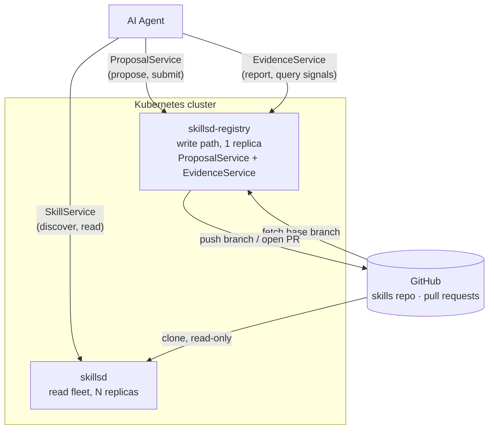

**`skillset` is an API for agents, not humans.** There's no client SDK, no REST
wrapper, and it isn't meant to be hand-integrated. Agents connect, discover
services, and call RPCs on their own.

If you're a human standing this up, see
[docs/quickstart.md](docs/quickstart.md).

## Why this exists

While `git` tracks changes, `skillset` tracks *outcomes*.

[Skills](https://agentskills.io) are how a fleet of AI agents remembers what
it's learned. `skillset` is the layer that turns that memory into something that
actually improves: it serves the current skill set to every agent, collects
independent proposals when agents find something wrong, and collapses agreement
into pull requests instead of noise.

Git remains the durable store underneath; human reviewers stay in charge of
merging any proposal into that permanent record.

`skillset` does what git alone can not:

- **It knows whether a skill worked.** A pull request saying *"an agent wants to
  change this"* tells a reviewer little. One saying *"this version was cited by
  142 sessions and contradicted reality in 18% of them, up from 2% on the prior
  commit"* tells them what to do next.
- **It collapses agreement instead of relaying it.** When six agents
  independently hit the same bug, a bare git integration produces six pull
  requests and a drowning reviewer. `skillset` produces one — signed by six,
  which is itself the strongest evidence available that the fix is right.
- **The service measures whether independent parties converged.** Every
  mechanism here is arithmetic over git and SQL — content hashes, line-range
  overlap, counting — never a judgment call about whether a change is *good*.
  That call always stays with whoever reviews the PR.

**No part of `skillset` itself runs an AI model, and none is planned.**

## Workloads

One chart, two Deployments:

| Workload | Role | Scale | Does |
|---|---|---|---|
| `skillsd` | Read path | N replicas, stateless | Serves the current skill set over gRPC, every skill attributed to the commit it came from |
| `skillsd-registry` | Write path (optional) | 1 replica, stateful | Turns agent proposals into git commits, deduplicates and clusters competing fixes, opens GitHub pull requests for human review |

## Architecture



Both workloads ship in one Helm chart ([charts/skillsd](charts/skillsd)) but
deploy independently: the read fleet scales horizontally and never mutates
anything; the registry is a single writer serializing git operations on its own
volume.

## Documentation

| Doc | Covers |
|---|---|
| [docs/quickstart.md](docs/quickstart.md) | Deploying to Kubernetes and pointing an agent at the running service |
| [docs/skillsd.md](docs/skillsd.md) | The read fleet — how it loads and serves skills, and why there's no runtime refresh |
| [docs/skillsd-registry.md](docs/skillsd-registry.md) | Proposals, consolidation, pull requests, and outcome reporting |
| [docs/data-stores.md](docs/data-stores.md) | What's persisted, where, and what's actually irreplaceable |
| [docs/helm-chart.md](docs/helm-chart.md) | Chart structure, full values reference, GitHub auth, installation |

Everything above is written for an operator. The agent-facing API reference is
`GetClientGuide` itself (see [internal/clientguide](internal/clientguide)).

RPC definitions live in [proto/skills/v1](proto/skills/v1); implementations in
[internal/](internal/).

## Local development

Local dev runs on a `kind` cluster provisioned by `ctlptl`, with Tilt handling
build/deploy/live-reload.

```bash
make dev
```

That's the whole default path — no GitHub account or repo needed. `make dev`
bootstraps a throwaway Gitea instance in the cluster (via `gitea-up`, a
prerequisite it runs for you) and points both components at it, so the full
read + propose + submit-PR path works offline.

To run against a real GitHub repo instead, create `local/github-app.json`
first. `make dev` then skips Gitea entirely and switches both components to
GitHub App auth.

See [local/README.md](local/README.md) for either path in full — registering
the app, seeding a different skills repo, teardown, and talking to the running
deployment.

## License

See [LICENSE](LICENSE).
