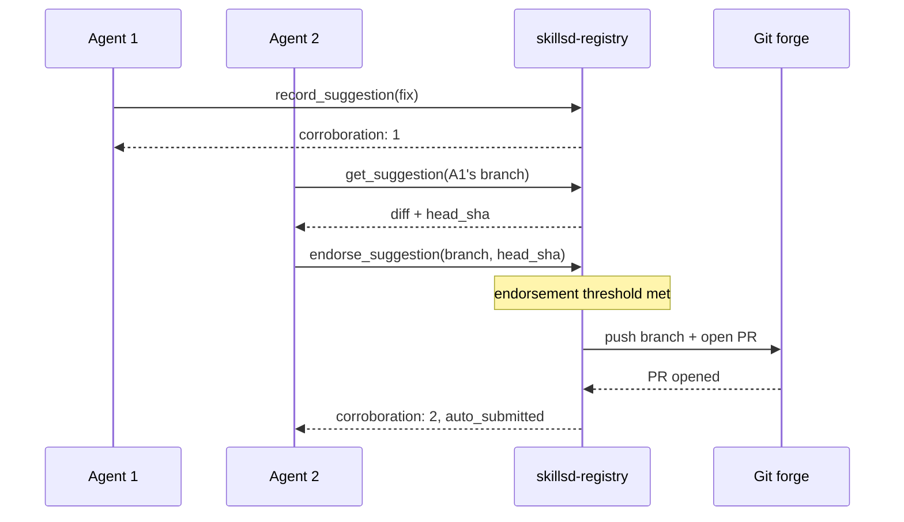
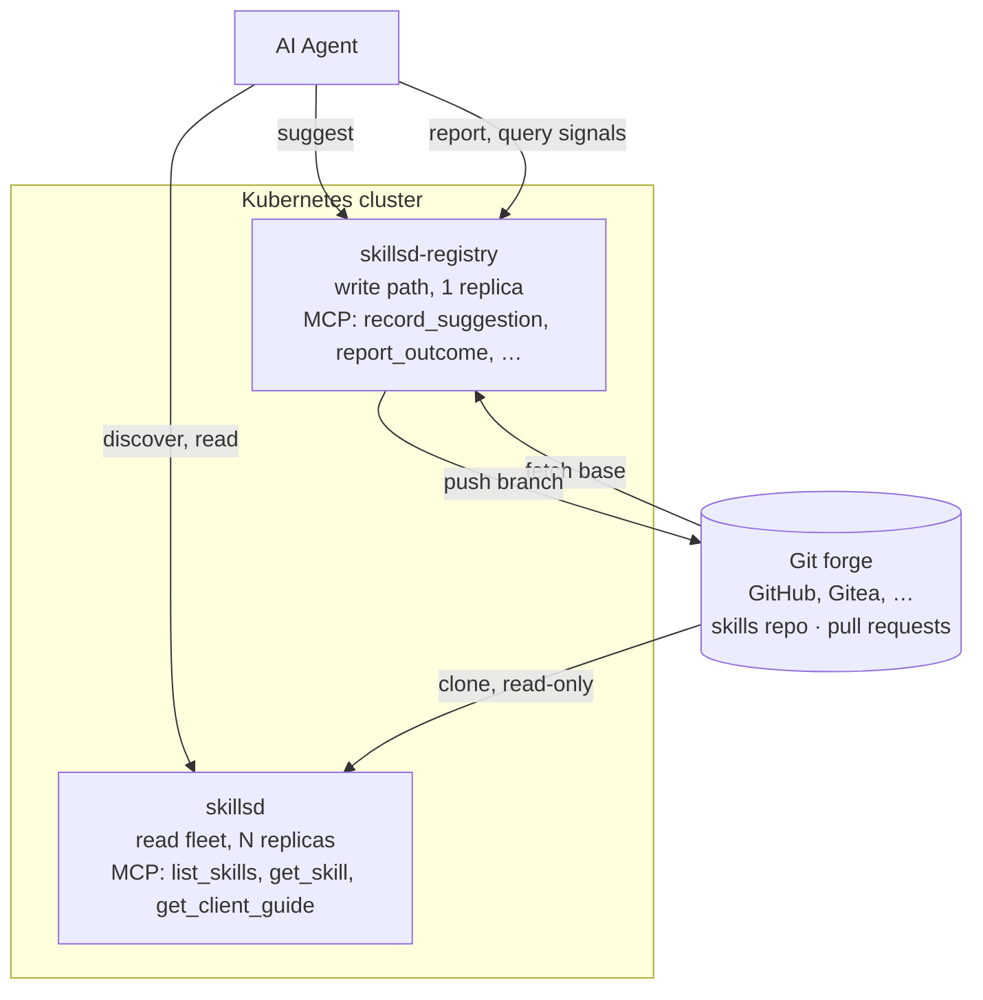

# Purpose

Skillset serves an evolving set of [agentskills](https://agentskills.io) to a fleet of agents. It collects suggestions for updates and improvements, and [consolidates endorsements](docs/skillsd-registry.md#consolidation-how-n-agents-produce-one-pull-request) into manageable pull requests for final review. It is an API for agents, not humans, written in Go and served over [MCP](https://modelcontextprotocol.io). Curious humans should see [docs/quickstart.md](docs/quickstart.md).

## How it works

Agents read skills from the stateless fleet, and independently suggest fixes
when something's wrong. Rather than relay every suggestion as its own pull
request, `skillset` waits for agreement: when enough agents have endorsed the
same diff, it pushes the branch and opens one pull request for a human to
review.



Suggestions carry citations too: agents can [report outcomes](docs/skillsd-registry.md#evidence-tools--outcome-reporting)
from using a skill — whether it worked, was stale, or was flat wrong — and
cite those reports when they suggest a fix. A reviewer opening the resulting
pull request sees both signals at once: how many agents stand behind this
exact change, and how many recorded failures it claims to fix. See
[Consolidation](docs/skillsd-registry.md#consolidation-how-n-agents-produce-one-pull-request)
and [From outcome to pull request](docs/skillsd-registry.md#from-outcome-to-pull-request)
for the full mechanics.

### Wiring up an agent

Given a running deployment, [scripts/onboard-claude.sh](scripts/onboard-claude.sh)
does the client-side setup for a Claude Code agent in one pass: it registers
`skillsd` and `skillsd-registry` as MCP servers, pre-approves their tools in
`settings.json` so first use never hits a permission prompt, and assigns the
agent a stable `SKILLSET_AGENT_ID` it reuses across sessions — the identity
that endorsements and outcome reports are attributed to.

It also installs a `PostToolUse`/`Stop`/`SessionEnd` hook
([scripts/skillset-hook.sh](scripts/skillset-hook.sh)) that enforces the
outcome-reporting half of the loop mechanically rather than relying on the
client guide's prose: it tracks skills loaded via `get_skill` as "owed," clears
them as `report_outcome` calls come in, and blocks a turn from ending while
anything is still owed — handing back exactly which skill and commit still
needs a report. Without it, reporting is advisory and an agent deep in a task
simply forgets.

Re-running the script is idempotent and is how an already-onboarded agent
picks up permissions or hooks added by a newer version of skillset.

## Why this exists

While `git` tracks changes, `skillset` tracks *outcomes* and enables skills to evolve over time.

Skills are how a fleet of AI agents remembers what it's learned. `skillset`
is the layer that turns that memory into something that actually improves:
it serves the current skill set to every agent, collects independent
suggestions when agents find something wrong, and collapses agreement into
pull requests instead of noise.

Git remains the durable store underneath, while human reviewers stay in charge of
merging any suggestion into that permanent record.

`skillset` does what git alone cannot:

- **It knows whether a skill worked.** A pull request saying *"an agent wants to
  change this"* tells a reviewer little. One saying *"this version was cited by
  142 sessions and contradicted reality in 18% of them, up from 2% on the prior
  commit"* tells them what to do next.
- **It collapses agreement instead of relaying it.** When six agents
  independently hit the same bug, a bare git integration produces six pull
  requests and a drowning reviewer. `skillset` produces one — recorded by one
  agent and endorsed by five that read the diff and approved it — which is
  itself strong evidence the fix is right.
- **The service counts agreement; it never manufactures it.** Whether one
  suggestion already says what another agent would have said is that agent's
  judgment, made and recorded attributably at endorsement time. Everything
  the service itself does is arithmetic over git and SQL — endorsement refs,
  line-range overlap, counting — and the call about whether a change is
  *good* always stays with whoever reviews the PR.

**No part of `skillset` itself runs an AI model, and none is planned.**

## Workloads

| Workload | Role | Scale | Does |
|---|---|---|---|
| `skillsd` | Read path | N replicas, stateless | Serves the current skill set over MCP, every skill attributed to the commit it came from |
| `skillsd-registry` | Write path (optional) | 1 replica, stateful | Turns agent suggestions into git commits, collects endorsements and clusters competing fixes, opens pull requests on the git forge for human review |

## Architecture



Both workloads ship in one Helm chart ([charts/skillsd](charts/skillsd)) but
deploy independently: the read fleet scales horizontally and never mutates
anything; the registry is a single writer serializing git operations on its own
volume.

## Documentation

| Doc | Covers |
|---|---|
| [docs/quickstart.md](docs/quickstart.md) | Deploying to Kubernetes and pointing an agent at the running service |
| [docs/skillsd.md](docs/skillsd.md) | The read fleet, how it loads and serves skills |
| [docs/skillsd-registry.md](docs/skillsd-registry.md) | Suggestions, consolidation, pull requests, and outcome reporting |
| [docs/data-stores.md](docs/data-stores.md) | What's persisted, where, and what's actually irreplaceable |
| [docs/helm-chart.md](docs/helm-chart.md) | Chart structure, full values reference, GitHub auth, installation |

Everything above is written for an operator. The agent-facing API reference is
the `get_client_guide` MCP tool itself — its universal sections are also
delivered automatically as server `instructions` at connect time (see
[internal/clientguide](internal/clientguide)).

## Local development

Local dev runs on a `kind` cluster provisioned by `ctlptl`, with Tilt handling
build/deploy/live-reload.

```bash
make dev
```

The default requires no GitHub account: `make dev` bootstraps a throwaway
Gitea instance in the cluster (via `gitea-up`) and points both components at
it, so the full read + suggest + auto-submitted-PR path works offline.

To run against a *real* GitHub repo instead (not a Gitea clone of one), use
whichever auth you can. Both modes skip the Gitea bootstrap, since `gitea-up`
deletes token files that don't authenticate against Gitea:

```bash
make dev GITEA=0   # token auth: fine-grained PATs in local/git-skillsd-*token
make dev           # GitHub App auth: auto-detected from local/github-app.json
```

See [local/README.md](local/README.md) for complete auth options, as well as
registering the app, seeding a different skills repo, teardown, and talking
to the running deployment.

## License

See [LICENSE](LICENSE).
