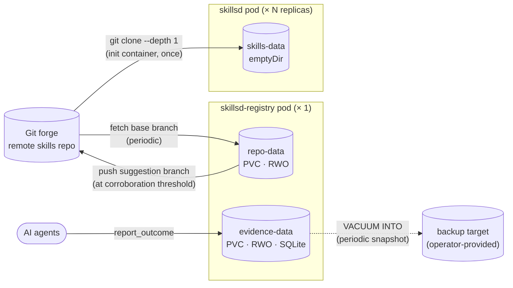

# Data stores

skillset touches three volumes. They have different owners, different durability
guarantees, and different backup needs — conflating them is the easiest way to
lose data that can't be recovered.

| Store | Backing | Owned by | Derived from git? | Backup needed? |
|---|---|---|---|---|
| `skills-data` | `emptyDir` | `skillsd`, per pod | Fully — re-cloned by the init container on every pod start | No |
| `repo-data` | PVC (`ReadWriteOnce`) | `skillsd-registry` | Mostly — see caveat below | Optional, for uptime |
| `evidence-data` | PVC (`ReadWriteOnce`), SQLite | `skillsd-registry` | **No** — primary data | **Yes** |

## skills-data

An `emptyDir`, populated once by a `git clone --depth 1` init container before
the main `skillsd` container starts, then mounted read-only for the container's
whole lifetime. It exists purely so `skillsd` has something local and fast to
serve from — it holds no state that outlives the pod, and every replica has its
own independent copy.

Losing it is a non-event: delete the pod, the init container re-clones on the
replacement. There is intentionally no shared/networked variant of this volume
(S3, a ConfigMap, NFS) — see
[skillsd.md](skillsd.md#no-runtime-refresh-by-design) for why a per-pod local
clone was chosen over a shared read path.

## repo-data

A `ReadWriteOnce` PVC holding `skillsd-registry`'s working copy of the skills
repository: the base branch (re-fetched from origin every `fetchInterval`,
default 5 minutes) plus every open suggestion branch it has committed to locally.

**Caveat:** most of this volume is a cache — the base branch is trivially
re-cloned. But a suggestion branch is pushed upstream only once it crosses
`autoSubmitEndorsements`; below the threshold it exists **only** in this
volume, and a suggestion no other agent ever corroborates stays here forever.
Deleting `repo-data` loses those suggestions, not just a cache of them. In
practice this is rarely worth backing up on its own merits (an agent can always
re-suggest), but it's not *purely* a cache the way `skills-data` is — and the
lower the threshold, the less of this volume is at risk.

Because exactly one replica ever writes here, the Deployment uses the `Recreate`
strategy — the old pod fully terminates (and unmounts) before the new one
starts, so two writers never contend for the same volume.

## evidence-data

A `ReadWriteOnce` PVC holding a SQLite database of outcome reports: the record
of which skill, at which commit, worked or didn't. **This is the only data in
skillset that isn't derived from git** — there's no remote to re-fetch it from,
and losing this volume loses the fleet's entire observed history, not a cache of
it.

Given that, it gets treated differently from `repo-data`:

- **Its own PVC**, so its lifecycle and backup policy are independent of the git
  working copy.
- **A `VACUUM INTO` snapshot loop** (`registry.evidence.backup.path`,
  `registry.evidence.backup.interval`) — point it at a *different* volume or a
  path your cluster's backup tooling already collects. A snapshot sitting on the
  disk it's meant to protect against losing is not a backup.
- **A mandatory retention pass** (`registry.evidence.retention`, default 90
  days) that folds reports older than the window into per-`(skill, commit,
  verdict)` aggregate counts, then deletes the raw rows. The aggregate — counts
  and rates — survives forever; free-text notes and individual report IDs do
  not. Setting retention to `0` disables the rollup and lets the database grow
  without bound.

Storage is SQLite (`modernc.org/sqlite`, pure Go — keeps the binaries
`CGO_ENABLED=0` on distroless), chosen because `skillsd-registry` is already a
single-writer, single-replica component holding a persistent volume; a database
server would add an operational dependency without buying anything the write
volume here needs. Revisit that once the read fleet needs to query evidence
directly, or write volume passes a few hundred/second.

Can be disabled entirely (`registry.evidence.enabled: false`), in which case
the evidence tools (`report_outcome`, `list_skill_signals`,
`list_outcome_reports`) are simply absent from this server's `tools/list`
and no database is opened.
