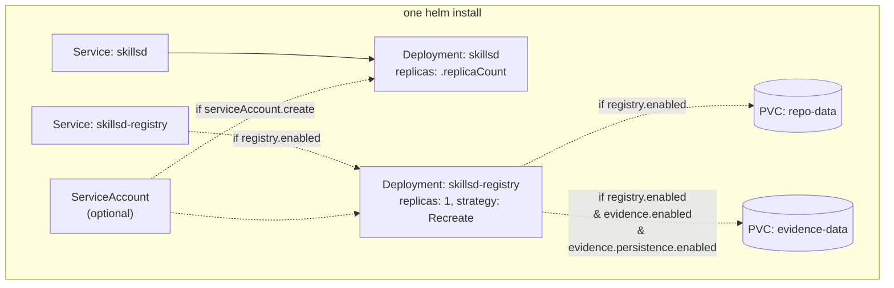

# Helm chart

Both components share one chart, [charts/skillsd](../charts/skillsd), and render
as independent Deployments.

## Resource graph



`registry.enabled` (default `true`) is the one flag that changes the shape of
the release: with it `false`, `deployment-registry.yaml`,
`service-registry.yaml`, and both PVC templates render nothing, and you get a
`skillsd` read fleet with no write path at all.

Naming: the fullname helper collapses to just the chart name (`skillsd`) when
the release name equals the chart name, otherwise `<release>-skillsd`; the
registry's resources are always `<fullname>-registry`. See
[`_helpers.tpl`](../charts/skillsd/templates/_helpers.tpl).

## Installation

```bash
helm install skillsd charts/skillsd \
  --set skillsRepo.url=https://github.com/<org>/<skills-repo>.git \
  --set-string registry.enabled=false   # or configure registry.* to enable it
```

Or, more realistically, with a values file:

```bash
helm install skillsd charts/skillsd -f my-values.yaml
```

```bash
helm upgrade skillsd charts/skillsd -f my-values.yaml   # roll out a values/image change
helm uninstall skillsd                                   # tear down (PVCs survive by default)
```

`helm lint charts/skillsd` and `helm template skillsd charts/skillsd -f
my-values.yaml` (wrapped as `make helm-lint` / `make helm-template`) are worth
running before either command — a contradictory or half-filled GitHub auth block
fails the render outright rather than at pod start.

## GitHub authentication

Both components authenticate the same way — an HTTPS clone URL plus a credential
— and each is configured independently:

| | `skillsd` | `skillsd-registry` |
|---|---|---|
| Needs | `git clone` only | `git push` **and** the GitHub REST API (PR creation) |
| Values | `skillsRepo.githubApp.*` / `skillsRepo.tokenSecret` | `registry.github.githubApp.*` / `registry.github.tokenSecret` |
| Minimum permissions | `Contents: Read` | `Contents: Read and write` + `Pull requests: Read and write` |
| If unset | Fine for a public repo — no auth needed | All tools still work, but no pull request can ever open: proposals stay as local branches |

The chart itself enforces no scoping: it passes each component whatever
credential you name, and every permission boundary lives on GitHub's side, in
the app or token you created. The "minimum permissions" row is what each
component needs in order to work, not a constraint anything checks.

### GitHub App (recommended)

[Create and install an app](https://docs.github.com/en/apps/creating-github-apps/registering-a-github-app/registering-a-github-app)
on the skills repository, grant it the permissions above, generate a private
key, then:

```bash
kubectl create secret generic skillsd-github-app --from-file=private-key.pem=./your-app.private-key.pem
```

```yaml
skillsRepo:
  githubApp:
    appId: "Iv23xxxxxxxxxxxxxxxx"   # client ID or numeric app ID — either works
    installationId: "12345678"      # NOT the same value as appId
    privateKeySecret: skillsd-github-app
```

Three values are needed, and two of them are easy to confuse:

- **`appId`** — the app's client ID (`Iv23…`) or its numeric app ID. Both appear
  on the app's settings page and either can be used.
- **`installationId`** — find it in the installation's settings URL:
  `.../settings/installations/<installationId>`.
- **`privateKeySecret`** — an existing Secret holding the app's private key
  under the key `private-key.pem`.

### Token

A fine-grained PAT (`Contents: read`, plus `Pull requests: read/write` for the
registry) or a classic `repo` token still works.

```bash
kubectl create secret generic skillsd-git-auth --from-literal=token=<pat>
```

```yaml
skillsRepo:
  tokenSecret: skillsd-git-auth
```

Setting both `tokenSecret` and `githubApp` on the same component fails the
render, as does a partially-filled `githubApp` block. All secrets are expected
to already exist in the cluster — the chart references them by name, it doesn't
create them.

For local dev, the Tiltfile creates them for you from gitignored files; see
[quickstart.md](quickstart.md) and [../local/README.md](../local/README.md).

## `skillsd` values

| Value | Default | Env var | Description |
|---|---|---|---|
| `replicaCount` | `2` | — | Read-fleet replica count |
| `image.repository` / `.tag` | `ghcr.io/araghukas/skillsd` / `""` | — | Image for the `skillsd` container; empty `tag` falls back to the chart's `appVersion` |
| `httpAddr` | `:8080` | `HTTP_ADDR` | MCP (Streamable HTTP) listen address |
| `logLevel` | `info` | `LOG_LEVEL` | Minimum slog level |
| `maxRequestBodyMiB` | `8` | `MAX_REQUEST_BODY_BYTES` | Cap on a single incoming MCP request body |
| `maxResultKiB` | `256` | `MAX_RESULT_BYTES` | Cap on context-file bytes a single `get_skill` call returns — note the unit is **KiB**, not MiB |
| `service.type` / `.port` | `ClusterIP` / `8080` | — | `skillsd`'s Service |
| `skillsRepo.url` | `""` | `SKILLS_REPO_URL` (init container) | HTTPS clone URL |
| `skillsRepo.branch` | `main` | `SKILLS_REPO_BRANCH` (init container) | Branch shallow-cloned (depth 1) |
| `skillsRepo.subPath` | `skills` | `SKILLS_SUBPATH` | Subdirectory holding skill directories |
| `skillsRepo.githubApp.appId` | `""` | `GITHUB_APP_ID` | App client ID or numeric app ID |
| `skillsRepo.githubApp.installationId` | `""` | `GITHUB_APP_INSTALLATION_ID` | Installation to act as |
| `skillsRepo.githubApp.privateKeySecret` | `""` | — | Secret (key `private-key.pem`), mounted at `/etc/github-app` |
| `skillsRepo.tokenSecret` | `""` | `GITHUB_TOKEN` | Secret (key `token`) for a private repo |
| `skillsRepo.apiBaseURL` | `""` | `GITHUB_API_BASE_URL` | Token-exchange host, for GitHub Enterprise |
| `mountPath` | `/skills` | `SKILLS_DIR` | Where the volume is mounted in both containers |
| `resources` | `{}` | — | Pod resource requests/limits |
| `podSecurityContext` | uid/gid `65532`, `fsGroup: 65532` | — | Applied to every pod. `fsGroup` must match the image's user, or the mounted GitHub App key is unreadable |

## `skillsd-registry` values

| Value | Default | Env var | Description |
|---|---|---|---|
| `registry.enabled` | `true` | — | Renders the registry's Deployment/Service/PVCs at all |
| `registry.image.repository` / `.tag` | `ghcr.io/araghukas/skillsd` / `""` | — | Same image, different entrypoint (`/skillsd-registry`); empty `tag` falls back to the chart's `appVersion` |
| `registry.httpAddr` | `:8081` | `HTTP_ADDR` | MCP (Streamable HTTP) listen address |
| `registry.service.type` / `.port` | `ClusterIP` / `8081` | — | Registry's Service |
| `registry.fetchInterval` | `5m` | `FETCH_INTERVAL` | Background re-fetch of the base branch |
| `registry.maxRequestBodyMiB` | `8` | `MAX_REQUEST_BODY_BYTES` | Cap on a single incoming MCP request body (a whole `propose_change` call) |
| `registry.maxResultKiB` | `256` | `MAX_RESULT_BYTES` | Cap on bytes a single `get_skill_at_ref` or `get_proposal` call returns — **KiB**, not MiB |
| `registry.maxFileContentSizeMiB` | `1` | `MAX_FILE_CONTENT_BYTES` | Cap on a single proposed file's content |
| `registry.repoDir` | `/var/lib/skillsd-registry` | `REPO_DIR` | Working copy path (on `repo-data`) |
| `registry.persistence.size` / `.storageClassName` | `1Gi` / `""` | — | `repo-data` PVC sizing |
| `registry.skillsRepo.url` | `""` | `SKILLS_REPO_URL` | Clone URL — usually the same repo as `skillsRepo.url`, configured with its own credential |
| `registry.skillsRepo.baseBranch` | `main` | `SKILLS_REPO_BASE_BRANCH` | Branch proposals fork from / PRs target |
| `registry.skillsRepo.subPath` | `skills` | `SKILLS_SUBPATH` | Subdirectory holding skill directories |
| `registry.autoSubmitEndorsements` | `2` | `AUTO_SUBMIT_ENDORSEMENTS` | Corroboration count that opens a PR — the only path to one; `0` keeps proposals local, see [skillsd-registry.md](skillsd-registry.md#consolidation-how-n-agents-produce-one-pull-request). `2` is this chart's default, set explicitly in `values.yaml` — the binary's own fallback when the env var is absent entirely (e.g. run outside the chart) is `0` |
| `registry.github.owner` / `.repo` | `""` / `""` | `GITHUB_OWNER` / `GITHUB_REPO` | Target repo for pull requests |
| `registry.github.githubApp.appId` | `""` | `GITHUB_APP_ID` | App client ID or numeric app ID |
| `registry.github.githubApp.installationId` | `""` | `GITHUB_APP_INSTALLATION_ID` | Installation to act as |
| `registry.github.githubApp.privateKeySecret` | `""` | — | Secret (key `private-key.pem`), mounted at `/etc/github-app` |
| `registry.github.tokenSecret` | `""` | `GITHUB_TOKEN` | Secret (key `token`); no credential at all ⇒ proposals are never pushed |
| `registry.github.apiBaseURL` | `https://api.github.com` | `GITHUB_API_BASE_URL` | Override for GitHub Enterprise (and the local Gitea stand-in) |
| `registry.resources` | `{}` | — | Pod resource requests/limits |

## `skillsd-registry` evidence values

| Value | Default | Env var | Description |
|---|---|---|---|
| `registry.evidence.enabled` | `true` | `EVIDENCE_ENABLED` | Registers the evidence tools (`report_outcome`, `list_skill_signals`, `list_outcome_reports`) at all — disabled, they're absent from `tools/list` |
| `registry.evidence.dbPath` | `/var/lib/skillsd-evidence/evidence.db` | `EVIDENCE_DB_PATH` | SQLite file, on `evidence-data` |
| `registry.evidence.verifyCommits` | `true` | `EVIDENCE_VERIFY_COMMITS` | Reject reports naming a skill/commit the repo doesn't contain |
| `registry.evidence.retention` | `2160h` (90d) | `EVIDENCE_RETENTION` | Age at which raw reports roll up into aggregates and are deleted; `0` disables |
| `registry.evidence.rollupInterval` | `24h` | `EVIDENCE_ROLLUP_INTERVAL` | How often the retention pass runs |
| `registry.evidence.persistence.enabled` | `true` | — | `false` uses an `emptyDir` — reports don't outlive the pod |
| `registry.evidence.persistence.size` / `.storageClassName` | `1Gi` / `""` | — | `evidence-data` PVC sizing |
| `registry.evidence.backup.path` | `""` | `EVIDENCE_BACKUP_PATH` | `VACUUM INTO` snapshot target — point it off-volume |
| `registry.evidence.backup.interval` | `24h` | `EVIDENCE_BACKUP_INTERVAL` | Snapshot frequency |

See [data-stores.md](data-stores.md#evidence-data) for why these two values
(persistence and backup) matter more here than anywhere else in the chart.

## Operational notes

- **`skillsd-registry` uses `Recreate`, not `RollingUpdate`.** It's a single
  writer on a `ReadWriteOnce` volume; `Recreate` guarantees the old pod has
  fully unmounted before the new one starts, so two pods never contend for
  `repo-data`. A rolling update strategy here would occasionally deadlock a
  rollout waiting for a volume the outgoing pod still holds.
- **Both size fields under `persistence` are PVC requests, not limits** —
  resizing later depends on your `StorageClass` supporting volume expansion.
- **`nodeSelector` / `tolerations` / `affinity`** are shared top-level values
  applied to both Deployments identically; there's no per-component override for
  them today.
