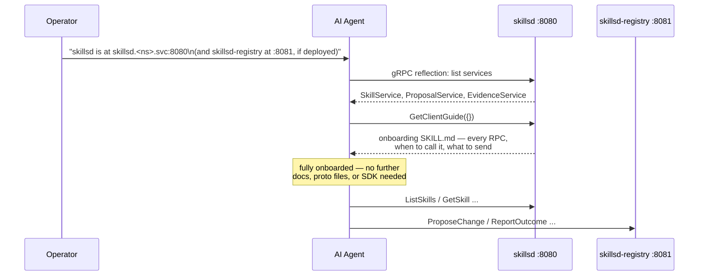

# Quickstart

Deploying `skillset` and pointing an agent at it, end to end.

## 1. Deploy the read fleet

The minimum viable deployment is just `skillsd`, pointed at a public skills repo, with the write path off:

```yaml
# values.yaml
skillsRepo:
  url: "https://github.com/<org>/<skills-repo>.git"
  branch: main
  subPath: skills   # or "" if SKILL.md directories sit at repo root

registry:
  enabled: false
```

```bash
helm install skillsd charts/skillsd -f values.yaml
kubectl get pods -l app.kubernetes.io/instance=skillsd
kubectl port-forward svc/skillsd 8080:8080
grpcurl -plaintext localhost:8080 list          # confirm reflection + SkillService are up
```

A private repo needs a read-scoped token — create the secret first, then reference it:

```bash
kubectl create secret generic skillsd-git-auth --from-literal=token=<fine-grained PAT, Contents: read>
```

```yaml
skillsRepo:
  tokenSecret: skillsd-git-auth
```

## 2. Add the write path (optional)

Enable `skillsd-registry` once agents need to propose changes and/or report outcomes. It needs its own (more privileged) token:

```bash
kubectl create secret generic skillsd-registry-git-auth \
  --from-literal=token=<fine-grained PAT, Contents: read/write + Pull requests: read/write>
```

```yaml
registry:
  enabled: true
  skillsRepo:
    url: "https://github.com/<org>/<skills-repo>.git"
  github:
    owner: "<org>"
    repo: "<skills-repo>"
    tokenSecret: skillsd-registry-git-auth
```

```bash
helm upgrade skillsd charts/skillsd -f values.yaml
kubectl port-forward svc/skillsd-registry 8081:8081
grpcurl -plaintext localhost:8081 list skills.v1.ProposalService
```

Full value reference: [helm-chart.md](helm-chart.md). Storage/backup implications of turning this on: [data-stores.md](data-stores.md).

## 3. Point an agent at it

This is the only integration step — there's no SDK to install. An agent needs exactly two things: an endpoint, and the instruction to onboard itself.



In practice, "point an agent at it" means putting one or two lines in whatever system prompt or tool config wires the agent up — something like:

```
You have access to a skillsd gRPC endpoint at skillsd.<namespace>.svc.cluster.local:8080
(and, if available, skillsd-registry at :8081). On first use, call
SkillService.GetClientGuide (no arguments) to learn the full API — which RPCs
to call, when, and with what fields. Do this before assuming any RPC's shape.
```

Everything past that point is between the agent and `GetClientGuide` — that guide (served by the running binary itself, not this repo) is the actual API reference. Treat it as authoritative over anything written here if the two ever disagree.

## 4. Local development

For iterating on `skillset` itself (not just deploying it), `make dev` brings up a local `kind` cluster with Tilt handling build/deploy/live-reload — see the root [README.md](../README.md#local-development) for prerequisites and [local/README.md](../local/README.md) for a full `grpcurl` walkthrough against the local instance.
