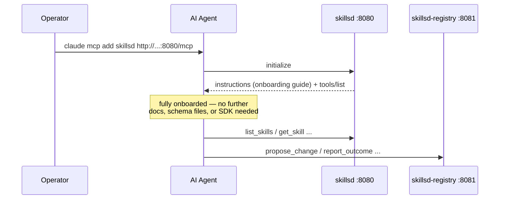

# Quickstart

Deploying `skillset` and pointing an agent at it, end to end.

## 1. Deploy the read fleet

The minimum viable deployment is just `skillsd`, pointed at a public skills
repo, with the write path off:

```yaml
# values.yaml
skillsRepo:
  url: "https://github.com/<org>/<skills-repo>.git"
  branch: main
  subPath: skills   # or "" if SKILL.md directories sit at repo root

registry:
  enabled: false
```

```bash
helm install skillsd charts/skillsd -f values.yaml
kubectl get pods -l app.kubernetes.io/instance=skillsd
kubectl port-forward svc/skillsd 8080:8080
curl -fsS localhost:8080/healthz                # confirm the pod is up
claude mcp add --transport http skillsd http://localhost:8080/mcp
```

A private repo needs credentials. The recommended route is a GitHub App:

1. [Register a GitHub App](https://docs.github.com/en/apps/creating-github-apps/registering-a-github-app/registering-a-github-app)
   with `Contents: Read` under repository permissions.
2. Generate a private key and download the `.pem`.
3. Install the app on the skills repository. Note its **app ID** (or client ID)
   from the app's settings page, and its **installation ID** from the
   installation URL — `.../settings/installations/<installationId>`. These are
   two different numbers.

```bash
kubectl create secret generic skillsd-github-app --from-file=private-key.pem=./your-app.private-key.pem
```

```yaml
skillsRepo:
  githubApp:
    appId: "Iv23xxxxxxxxxxxxxxxx"
    installationId: "12345678"
    privateKeySecret: skillsd-github-app
```

<details> <summary>Or, a token</summary>

A fine-grained PAT still works, and is the only option against a host with no
GitHub App equivalent. Set `tokenSecret` **or** `githubApp`, not both:

```bash
kubectl create secret generic skillsd-git-auth --from-literal=token=<fine-grained PAT, Contents: read>
```

```yaml
skillsRepo:
  tokenSecret: skillsd-git-auth
```
</details>

## 2. Add the write path (optional)

Enable `skillsd-registry` once agents need to propose changes and/or report
outcomes. It needs its own, more privileged credential: `Contents: Read and
write` plus `Pull requests: Read and write`. Keeping it separate from step 1's
is the point — the read fleet has no business holding something that can push.

```yaml
registry:
  enabled: true
  skillsRepo:
    url: "https://github.com/<org>/<skills-repo>.git"
  github:
    owner: "<org>"
    repo: "<skills-repo>"
    githubApp:
      appId: "Iv23yyyyyyyyyyyyyyyy"
      installationId: "87654321"
      privateKeySecret: skillsd-registry-github-app
```

<details> <summary>Or, a token</summary>

```bash
kubectl create secret generic skillsd-registry-git-auth \
  --from-literal=token=<fine-grained PAT, Contents: read/write + Pull requests: read/write>
```

```yaml
registry:
  github:
    tokenSecret: skillsd-registry-git-auth
```
</details>

```bash
helm upgrade skillsd charts/skillsd -f values.yaml
kubectl port-forward svc/skillsd-registry 8081:8081
curl -fsS localhost:8081/healthz
claude mcp add --transport http skillsd-registry http://localhost:8081/mcp
```

Full value reference: [helm-chart.md](helm-chart.md). Storage/backup
implications of turning this on: [data-stores.md](data-stores.md).

## 3. Point an agent at it

This is the only integration step — there's no SDK to install, and for an
MCP-capable harness there isn't even a prompt to write. Add both servers as
MCP servers, e.g.:

```bash
claude mcp add --transport http skillsd http://skillsd.<namespace>.svc.cluster.local:8080/mcp
claude mcp add --transport http skillsd-registry http://skillsd-registry.<namespace>.svc.cluster.local:8081/mcp
```



## 4. Local development

For iterating on `skillset` itself (not just deploying it), `make dev` brings up
a local `kind` cluster with Tilt handling build/deploy/live-reload — see the
root [README.md](../README.md#local-development) for prerequisites and
[local/README.md](../local/README.md) for a full MCP walkthrough against
the local instance.
