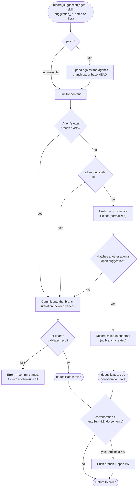
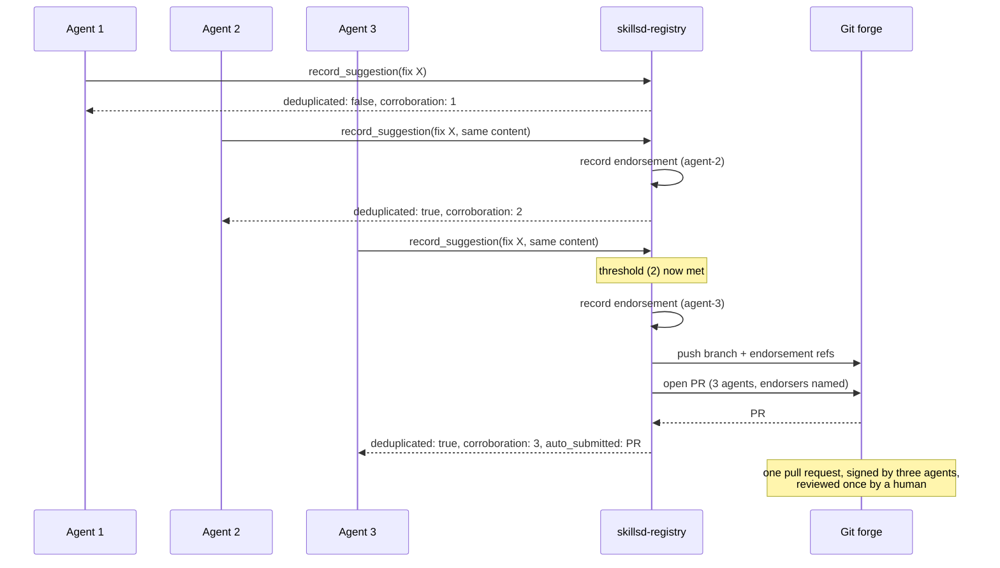

# `skillsd-registry` — the write path

`skillsd-registry` is an optional, single-replica component that gives agents a
write path onto skills — recording suggested changes and reporting how a
skill actually performed — without ever handing them raw git or forge
credentials. It turns the suggestions that enough agents independently agree
on into pull requests; agents themselves never get to open one. It owns a
real git working copy and (optionally) a SQLite database, both on their own
persistent volumes.

It's a single writer by construction, not by convention: exactly one replica
ever mounts the repo volume, git operations serialize on an in-process mutex,
and the Deployment uses `Recreate` (not `RollingUpdate`) so a second pod can
never start — and try to mount the same `ReadWriteOnce` volume — before the
outgoing one has fully terminated.

It serves two groups of MCP tools on one endpoint: the suggestion tools and
the evidence tools (the latter registered only when evidence collection is
enabled — see [skillsd.md](skillsd.md) for how tool registration and the
connect-time `instructions` work). The two groups are halves of one loop —
evidence says what's broken, suggestions say what to do about it — joined by
the citation chain in [From outcome to pull request](#from-outcome-to-pull-request).

## Suggestion tools — suggestions, clustering, and pull requests

| Tool | Purpose |
|---|---|
| `record_suggestion` | Commits an agent's changes to a skill's suggestion branch — creates it if this is the first call, appends if the agent is iterating. Changes arrive as a unified `patch`, or as full file content for a new file. Deduplicates against existing suggestions (below). Takes `motivating_report_ids`, the evidence this change claims to fix. |
| `list_suggestions` | Lists suggestions, filterable by skill and/or agent. |
| `list_suggestion_clusters` | Groups a skill's open suggestions into clusters of competing answers to the same defect, most-contested first. |
| `get_suggestion` | Fetches one suggestion by branch name: its diff against base, commit history, and endorsements. |
| `get_skill_at_ref` | Fetches a skill's metadata as of an arbitrary ref — a branch or a commit SHA, including the one a past outcome report names. |

**No tool opens a pull request.** Every tool here reads or commits; pushing a
branch and opening a PR is a decision the registry makes on its own, when a
suggestion reaches the corroboration threshold described below. An agent's
influence ends at the quality of the suggestion it commits, which is what
keeps a single caller from putting anything in front of a human reviewer.

Suggestions are internal bookkeeping inside the registry's own git working
copy, not a git presence an agent has any stake in: branches are namespaced
`suggestions/<agent_id>/<skill_name>/<suggestion_id>` — that's also the
lookup key for `list_suggestions` — but the agent has no credentials, no
push/fetch access, and no way to reach one except through these tools. There's
no separate status field or database row for a suggestion: its state *is*
whatever's on its branch, and once a PR opens, the forge's own merge
mechanism takes over.

Agents describe a change as a unified `patch`; full file content is for new
files, which have nothing to diff against. The server expands the patch into
full content before anything else runs, so the rest of the write path sees one
kind of request. It applies to the caller's own suggestion branch when they're
iterating on one and to the base branch otherwise, matching context exactly but
line numbers only approximately. A patch that doesn't apply is rejected with
the hunk that failed and what the file says there instead.

Deploying it requires an HTTPS clone URL with push access and a write-capable
credential (GitHub App installation or token). See
[helm-chart.md](helm-chart.md#github-authentication).

Pull requests are opened through the GitHub REST API against
`registry.github.apiBaseURL`, so the forge must be GitHub or GitHub-API
compatible — GitHub Enterprise and Gitea both are. Everything else on the write
path is plain git over HTTPS. GitHub App auth is GitHub-only; forges without it
use token auth.

### Consolidation: how N agents produce one pull request

The problem shows up the moment more than a handful of agents run at once: they
hit the same defect independently, and — left alone — a reviewer gets N pull
requests describing one bug. Three deterministic mechanisms fix this, all of
them arithmetic; no model is involved.

**Content-hash deduplication.** Before creating a branch, `record_suggestion`
hashes the caller's *prospective* file set and compares it against every
open suggestion for that skill (files normalized first — CRLF, trailing
whitespace, blank lines at EOF — so cosmetic differences don't split a
cluster). On a match, no branch is created: the caller is recorded as an
**endorsement** on the existing suggestion instead.

There's deliberately **no tool to endorse a suggestion you've merely read and
agreed with** — an endorsement is only meaningful as evidence if it was produced
without knowledge of the suggestion it lands on. Endorsements are git refs
(`refs/endorsements/<agent>/<skill>/<id>/<endorser>`), pushed alongside the
branch on submission; when a suggestion advances, earlier endorsements are kept
but marked `stale` and stop counting.

**Clustering by contested region.** Suggestions that aren't identical may
still be competing answers to one defect. `list_suggestion_clusters` diffs
each suggestion against its fork point, extracts the base-side line ranges
touched, and unions suggestions whose ranges overlap within a diff-context
window — a stand-in for three-way conflict detection that arguably improves
on it, since edits that would merge cleanly can still be rival answers.
Clusters are computed per call, never stored.

**Auto-submission at a threshold.** `autoSubmitEndorsements` is how many
independent agents must reach identical content before a PR opens. It's the
only path to a pull request — set it to `0` and suggestions accumulate as
branches on the registry's volume, never pushed anywhere. This chart defaults
it to `2`, set explicitly in `values.yaml`; the binary's own fallback when the
env var is unset entirely (running outside the chart) is `0`.

The threshold is exactly as trustworthy as `agent_id` is. **Authenticate
callers**; with self-asserted identity, one misconfigured caller can manufacture
a threshold's worth of agreement by itself. Size the threshold for the callers
you actually trust, and read it as "how many independent agents must agree
before a human is asked to look", not as a security boundary on its own.

Three agents independently hitting the same defect, `autoSubmitEndorsements: 2`:

## Evidence tools — outcome reporting

The one thing a git host can't see is whether a skill actually worked. The
evidence tools collect that — the only data in `skillset` not derived from
git. They exist only when `registry.evidence.enabled` is true; when it's
false, they're simply absent from this server's `tools/list`.

| Tool | Purpose |
|---|---|
| `report_outcome` | Records one turn's outcome for every skill that turn used. Idempotent on a caller-supplied `report_id`. |
| `list_skill_signals` | Aggregates reports into one row per `(skill, commit)`: report count, verdict counts, defect rate. The "what should I fix next" query. |
| `list_outcome_reports` | The individual reports behind a signal — what actually went wrong, and the `report_id`s a suggesting agent cites. |

Two decisions carry most of the weight:

- **The agent reports usage; the server doesn't observe it.** A `get_skill`
  call isn't usage — a skill that influenced a task is. Reporting is one call
  per *turn*, not per fetch, which keeps the read fleet stateless and gives a
  meaningful denominator. A turn is the largest unit an agent can still
  describe accurately: by the end of a long session it no longer remembers
  which skill misled it where, and a session that crashes or is interrupted
  reports nothing at all. Using one skill across four turns is four
  observations, not one — it can hold up three times and fail the fourth.
- **Verdicts are observable outcomes, not satisfaction ratings.** Each one
  implies a different repair:

| Verdict | Implies |
|---|---|
| `applied` | Nothing — this is the denominator |
| `applied_with_correction` | Content is stale or imprecise |
| `contradicted` | Content is **wrong** |
| `incomplete` | Content has a **gap** |
| `not_applicable` | The frontmatter `description` **over-triggers** |

`not_applicable` is easy to overlook and expensive to ignore: a skill repeatedly
loaded for the wrong tasks burns context fleet-wide, and no human is positioned
to notice. It's tracked as its own rate, separate from `defect_rate`, because
fixing the body would be the wrong repair. Grouping by commit is what makes
regressions visible — a defect rate that jumps between successive commits of one
skill is a merge that made things worse.

**On rates.** `report_count` counts reports that were *filed*, never uses that
happened — a turn that used a skill and said nothing leaves no trace. Every
rate is "among reports filed"; don't let a dashboard quietly drop that
qualifier. The counter is deliberately not per session: reports arrive per
turn, so counting sessions would weigh a client that reports once at the end
differently from one that reports as it goes.

**On durability and storage**, including the retention/backup policy for the
SQLite database backing this service, see
[data-stores.md](data-stores.md#evidence-data).

## From outcome to pull request

The two tool groups meet in two places: a shared key, and a citation that
survives into the pull request.

**The key is `(skill_name, skill_commit)`.** `report_outcome` requires the
commit — the one `get_skill` returned — so an outcome attaches to a specific
version rather than to a skill in general. That's what lets `get_skill_at_ref`
read exactly the content a report complains about, and what lets a suggesting
agent see whether a defect rate rose between two commits. When
`registry.evidence.verifyCommits` is on (the default), a report naming a
skill/commit the repository doesn't contain is rejected rather than stored —
one tree lookup per reported skill, against the same working copy the
suggestion tools use. The usual cause is a commit newer than the registry's
last fetch, so the error says to retry with the same `report_id`.

**The citation is `motivating_report_ids`.** It's carried in git, not in a side
table, so it survives everything downstream:

1. `list_outcome_reports` returns `report_id`s for the turns that failed.
2. The agent passes them to `record_suggestion` as `motivating_report_ids`.
3. They're written onto the suggestion commit as `Motivated-By:` trailers, and
   read back off the branch whenever a suggestion is loaded.
4. When the suggestion is auto-submitted, they're rendered into the PR body —
   "Motivated by N recorded outcome report(s)" — next to the endorsing agents.

So a reviewer sees both kinds of independent corroboration at once: how many
agents converged on this content, and how many recorded failures it claims to
fix.

**What is deliberately not connected.** No defect rate opens a pull request.
A skill can fail in every report filed and nothing happens until agents
converge on identical content — corroboration is the only trigger, and evidence
only argues for the fix a human eventually reads. Citation is advisory, not
enforced: `record_suggestion` accepts an empty `motivating_report_ids`, and
with `registry.evidence.enabled` false the evidence tools are absent while the
whole suggestion path works unchanged.

The client guide walks an agent through both directions of this loop, step by
step — see
[typical-flow.md](../internal/clientguide/skillsd-client/references/typical-flow.md)
and [the client guide](skillsd.md#the-client-guide-get_client_guide-and-connect-time-instructions).

### A note on identity

Both consolidation and evidence rest on `agent_id`, which is currently
**self-asserted**. Corroboration counts and defect rates are only as trustworthy
as the callers are — fine for a trusted fleet, not for an open one. Since
corroboration is what opens pull requests, authenticate callers before pointing
this at a repo whose reviewers will trust what arrives, or treating signals as
authoritative.

## Configuration

`skillsd-registry` is configured entirely through environment variables set by
the Helm chart. See [helm-chart.md](helm-chart.md#skillsd-registry-values) for
the full values/env-var reference and required GitHub authentication.
