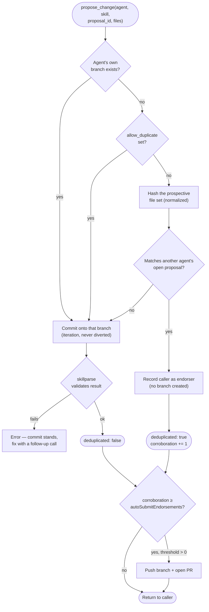

# `skillsd-registry` — the write path

`skillsd-registry` is an optional, single-replica component that gives agents a
write path onto skills — proposing changes, opening pull requests, and reporting
how a skill actually performed — without ever handing them raw git or forge
credentials. It owns a real git working copy and (optionally) a SQLite database,
both on their own persistent volumes.

It's a single writer by construction, not by convention: exactly one replica
ever mounts the repo volume, git operations serialize on an in-process mutex,
and the Deployment uses `Recreate` (not `RollingUpdate`) so a second pod can
never start — and try to mount the same `ReadWriteOnce` volume — before the
outgoing one has fully terminated.

It serves two groups of MCP tools on one endpoint: the proposal tools and the
evidence tools (the latter registered only when evidence collection is
enabled — see [skillsd.md](skillsd.md) for how tool registration and the
connect-time `instructions` work).

## Proposal tools — proposals, clustering, and pull requests

| Tool | Purpose |
|---|---|
| `propose_change` | Commits full new file content to a skill's proposal branch — creates it if this is the first call, appends if the agent is iterating. Deduplicates against existing proposals (below). |
| `list_proposals` | Lists proposals, filterable by skill and/or agent. |
| `list_proposal_clusters` | Groups a skill's open proposals into clusters of competing answers to the same defect, most-contested first. |
| `get_proposal` | Fetches one proposal by branch name: its diff against base, commit history, and endorsements. |
| `get_skill_at_ref` | Fetches a skill's metadata as of an arbitrary ref — a branch or a commit SHA. |
| `submit_proposal` | Pushes the branch upstream and opens a pull request for human review. Safe to retry — an existing pull request for the branch is returned rather than a second being opened. |

Branches are namespaced `proposals/<agent_id>/<skill_name>/<proposal_id>` —
that's also the lookup key for `list_proposals`. There's no separate status
field or database row for a proposal: its state *is* whatever's on its
branch, and once `submit_proposal` opens a PR, the forge's own merge
mechanism takes over. Agents send full file content rather than a patch, so
the server computes the diff itself and callers never need a base they may
not have in sync.

Deploying it requires an HTTPS clone URL with push access and a write-capable
credential (GitHub App installation or token). See
[helm-chart.md](helm-chart.md#github-authentication).

Pull requests are opened through the GitHub REST API against
`registry.github.apiBaseURL`, so the forge must be GitHub or GitHub-API
compatible — GitHub Enterprise and Gitea both are. Everything else on the write
path is plain git over HTTPS. GitHub App auth is GitHub-only; forges without it
use token auth.

### Consolidation: how N agents produce one pull request

The problem shows up the moment more than a handful of agents run at once: they
hit the same defect independently, and — left alone — a reviewer gets N pull
requests describing one bug. Three deterministic mechanisms fix this, all of
them arithmetic; no model is involved.

**Content-hash deduplication.** Before creating a branch, `propose_change`
hashes the caller's *prospective* file set and compares it against every
open proposal for that skill (files normalized first — CRLF, trailing
whitespace, blank lines at EOF — so cosmetic differences don't split a
cluster). On a match, no branch is created: the caller is recorded as an
**endorsement** on the existing proposal instead.

There's deliberately **no tool to endorse a proposal you've merely read and
agreed with** — an endorsement is only meaningful as evidence if it was produced
without knowledge of the proposal it lands on. Endorsements are git refs
(`refs/endorsements/<agent>/<skill>/<id>/<endorser>`), pushed alongside the
branch on submission; when a proposal advances, earlier endorsements are kept
but marked `stale` and stop counting.

**Clustering by contested region.** Proposals that aren't identical may still be
competing answers to one defect. `list_proposal_clusters` diffs each proposal
against its fork point, extracts the base-side line ranges touched, and unions
proposals whose ranges overlap within a diff-context window — a stand-in for
three-way conflict detection that arguably improves on it, since edits that
would merge cleanly can still be rival answers. Clusters are computed per call,
never stored.

**Auto-submission at a threshold.** `autoSubmitEndorsements` is how many
independent agents must reach identical content before a PR opens unprompted. It
defaults to `0` (off) — deliberately, since this is the one behavior here that
acts on its own, and it's exactly as trustworthy as `agent_id` is.
**Authenticate callers before turning it on**; with self-asserted identity, one
misconfigured caller can manufacture a threshold's worth of agreement by itself.

Three agents independently hitting the same defect, `autoSubmitEndorsements: 2`:

## Evidence tools — outcome reporting

The one thing a git host can't see is whether a skill actually worked. The
evidence tools collect that — the only data in `skillset` not derived from
git. They exist only when `registry.evidence.enabled` is true; when it's
false, they're simply absent from this server's `tools/list`.

| Tool | Purpose |
|---|---|
| `report_outcome` | Records one session's outcome for every skill it used. Idempotent on a caller-supplied `report_id`. |
| `list_skill_signals` | Aggregates reports into one row per `(skill, commit)`: sessions, verdict counts, defect rate. The "what should I fix next" query. |
| `list_outcome_reports` | The individual reports behind a signal, so a proposing agent can cite report IDs. |

Two decisions carry most of the weight:

- **The agent reports usage; the server doesn't observe it.** A `get_skill`
  call isn't usage — a skill that influenced a task is. Reporting is one call
  per *session*, not per fetch, which keeps the read fleet stateless and gives
  a meaningful denominator.
- **Verdicts are observable outcomes, not satisfaction ratings.** Each one
  implies a different repair:

| Verdict | Implies |
|---|---|
| `applied` | Nothing — this is the denominator |
| `applied_with_correction` | Content is stale or imprecise |
| `contradicted` | Content is **wrong** |
| `incomplete` | Content has a **gap** |
| `not_applicable` | The frontmatter `description` **over-triggers** |

`not_applicable` is easy to overlook and expensive to ignore: a skill repeatedly
loaded for the wrong tasks burns context fleet-wide, and no human is positioned
to notice. It's tracked as its own rate, separate from `defect_rate`, because
fixing the body would be the wrong repair. Grouping by commit is what makes
regressions visible — a defect rate that jumps between successive commits of one
skill is a merge that made things worse.

**On rates.** `reported_sessions` counts sessions that *reported*, never
sessions that ran — a crashed session never reports. Every rate is "among
sessions that reported"; don't let a dashboard quietly drop that qualifier.

**On durability and storage**, including the retention/backup policy for the
SQLite database backing this service, see
[data-stores.md](data-stores.md#evidence-data).

### A note on identity

Both consolidation and evidence rest on `agent_id`, which is currently
**self-asserted**. Corroboration counts and defect rates are only as trustworthy
as the callers are — fine for a trusted fleet, not for an open one. Fix this
before enabling auto-submission or treating signals as authoritative.

## Configuration

`skillsd-registry` is configured entirely through environment variables set by
the Helm chart. See [helm-chart.md](helm-chart.md#skillsd-registry-values) for
the full values/env-var reference and required GitHub authentication.
