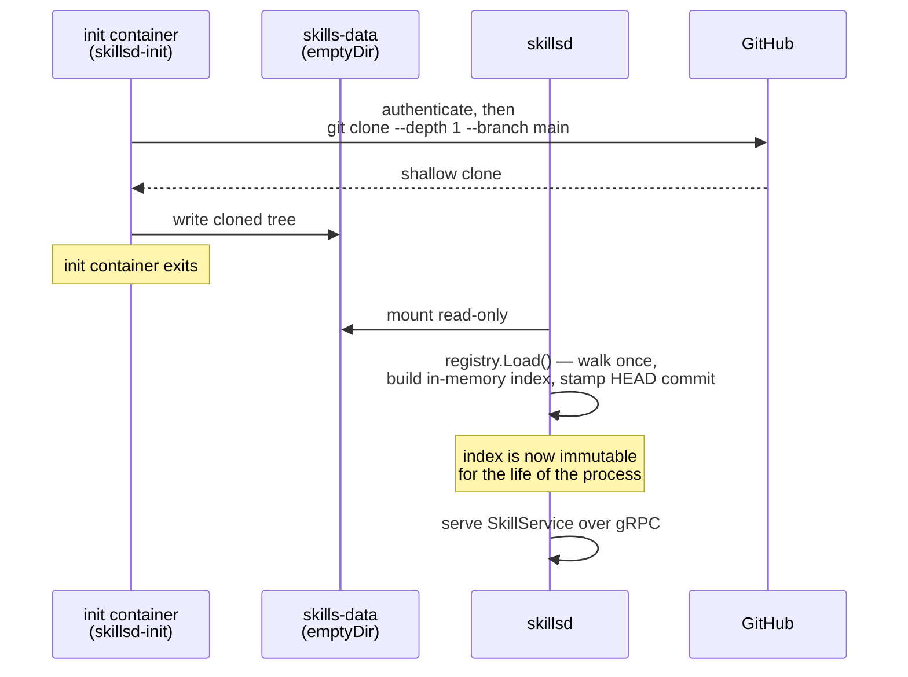

# `skillsd` — the read fleet

`skillsd` is the service agents actually read skills from: a stateless,
horizontally scalable gRPC fleet that serves a static, versioned snapshot of a
skills repository.

## What it serves

| RPC | Purpose |
|---|---|
| `ListSkills(category?, include_context_files?)` | Metadata for every skill — the "what exists" query. |
| `GetSkill(skill_name, include_context_files?)` | One skill's full content: `SKILL.md` plus `scripts/`, `references/`, `assets/`. |
| `GetClientGuide()` | The agent-facing onboarding doc for the whole API — see below. |

`grpc.health.v1.Health` is registered alongside `SkillService` for
liveness/readiness probes. Server reflection is on, so any gRPC client
(`grpcurl`, a generated stub, an agent) can discover all of this at runtime with
no `.proto` file in hand.

## How a pod comes up

Every replica repeats this independently — there's no leader, no shared cache,
no coordination between pods. `N` replicas means `N` independent clones of the
same ref, each serving from its own in-memory copy.

## No runtime refresh, by design

`registry.Load` runs exactly once, at startup, and a failed load is fatal (no
retry loop, no partial index). This is a deliberate trade for the property that
matters most here: reads never block, never hit disk, and never coordinate —
which is what lets the fleet scale horizontally by adding replicas with no other
change.

The consequence: **picking up new skill content means restarting the pod**, so
the init container re-clones. In practice that's a rolling restart of the
Deployment (`kubectl rollout restart`), not a config change or an RPC call —
there is intentionally no `RefreshSkillIndex` RPC.

`SKILLS_COMMIT` exists for the one case where a git working copy isn't what's
mounted (a baked image layer, a ConfigMap): it overrides the commit stamped onto
every served skill. Leave it unset when `SKILLS_DIR` is a real clone — `skillsd`
reads `HEAD` itself.

## Why the commit matters

Every `SkillMetadata` carries the git commit its content came from. That's what
lets a downstream outcome report (see
[skillsd-registry.md](skillsd-registry.md)) say *this exact version* of a skill
was cited and whether it held up — not just "the skill," which can't distinguish
a fix from the bug it fixed.

## The client guide (`GetClientGuide`)

An agent isn't expected to have read this file, a `.proto`, or any hand-written
integration doc. It's expected to call `GetClientGuide()` — no arguments, same
response shape as `GetSkill` — and use that as its onboarding instructions for
the entire API (`SkillService`, `ProposalService`, `EvidenceService`). Combined
with gRPC reflection, that one call is sufficient to fully onboard.

Its content is
[internal/clientguide/skillsd-client/SKILL.md](../internal/clientguide/skillsd-client/SKILL.md),
embedded into the server binary via `go:embed` — deliberately *not* read from
the skills repo `ListSkills` indexes, since it documents the API itself: it
ships versioned with the proto/server, stays available even if the skills repo
is empty or misconfigured, and never appears in `ListSkills`'s output.

**This README/docs tree and that guide serve different readers.** The guide is
the wire-protocol reference for an agent (or a human integrating one) — this doc
and its siblings cover deployment and operations.

## Configuration

`skillsd` is configured entirely through environment variables set by the Helm
chart. See [helm-chart.md](helm-chart.md#skillsd-values) for the full
values/env-var reference and the GitHub auth it needs for its init container's
clone.
